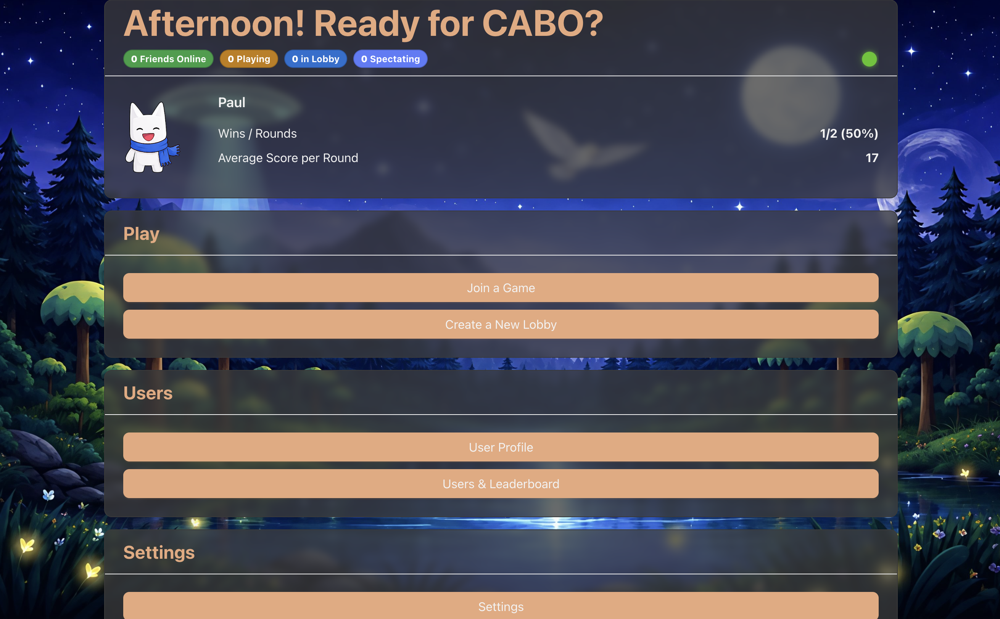
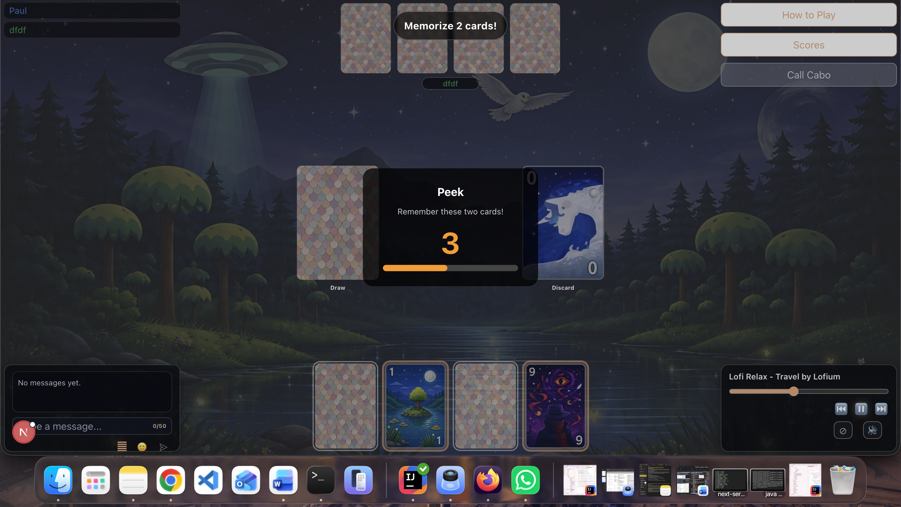
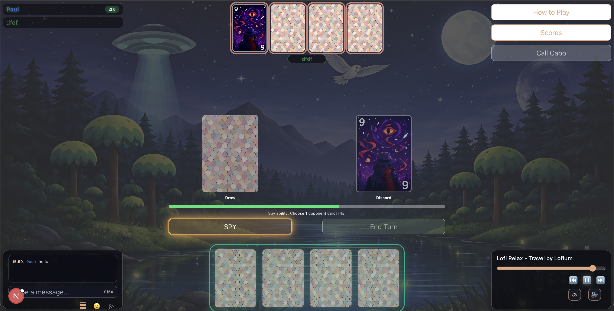

# Online CABO
A web-based multiplayer card game inspired by Cabo. Players memorize hidden cards, use special abilities, and strategically swap or reveal cards to finish rounds with the lowest total score. The code originated in a University of Zurich Software Engineering Lab group project and is now independently maintained as a personal project.

## Introduction
Goal: Provide a secure, stateful multiplayer backend for Cabo-style rounds—lobbies, live game state, moves, scoring, rematch, friends, and session history—so the web client can stay thin and event-driven.

Motivation: Cabo relies on hidden information, timed phases, and synchronized updates between players. A dedicated server enforces rules, persists session data, and broadcasts changes over WebSockets to clients.


## High-level Components
There are five main parts work together that enable the game experience:

**1. Authentication & User Management**
Handles login, registration, protected routes, profile display and session persistence. The [`DisconnectHandler.tsx`](app/components/DisconnectHandler.tsx) monitors connection state and redirects unauthenticated users automatically.
Main files: [`app/login/page.tsx`](app/login/page.tsx), [`app/users/[id]/page.tsx`](app/users/%5Bid%5D/page.tsx)

**2. Lobby & Session System**
Manages lobby creation, joining via session code or open lobby list, waiting room synchronization and player/spectator tracking. Real-time updates are delivered via WebSocket.
Main file: [`app/lobby/waiting/page.tsx`](app/lobby/waiting/page.tsx), [`app/lobby/join/page.tsx`](app/lobby/join/page.tsx)

**3. Game Engine**
The largest and most complex component. Manages the full game lifecycle including card drawing, swapping, special abilities (Peek, Spy, Swap), turn timers, AFK handling, flying card animations, WebSocket synchronization and rematch flow.
Main file: [`app/game/page.tsx`](app/game/page.tsx)

**4. Card & UI Components**
Renders all cards with correct front images, ability badges and interaction highlights. Also includes the peek timer, turn timer, scores modal and final score screen.
Main files: [`app/game/components/CardComponent.tsx`](app/game/components/CardComponent.tsx), [`app/game/components/PeekTimer.tsx`](app/game/components/PeekTimer.tsx), [`app/game/components/FinalScoreScreen.tsx`](app/game/components/FinalScoreScreen.tsx)

**5. History & Notifications**
Allows users to look up past sessions and their move logs. Real-time invite notifications are shown globally across all pages.
Main files: [`app/history/[sessionId]/page.tsx`](app/history/%5BsessionId%5D/page.tsx), [`app/CaboInviteNotifications.tsx`](app/CaboInviteNotifications.tsx)

The Lobby connects to the Game Engine via WebSocket events. The Game Engine uses CardComponent to render all cards. Authentication feeds the userId and token into every other component via localStorage hooks.

## Getting Started
With the following instructions will get a copy of the project up and running on the local machine. Note: 
The frontend requires the Spring Boot backend to be running at the same time. Please ensure the backend server is running before starting with the frontend. The API URLs are configured in `app/utils/domain.ts`.

### Prerequisites
Install the following software:
```
Node.js 24.18.0 LTS
npm 12.0.1
Git
```
The exact Node version is also recorded in `.nvmrc` and `.node-version`.

### Installing
Clone this repository:
```
git clone https://github.com/suisu-IT-daigakusei/sopra-fs26-group-26-client.git
cd sopra-fs26-group-26-client
```
Install dependencies:
```
npm ci
```
Start the development server:

```
npm run dev
```
The app will then be running at:
```
http://localhost:3000
```

### Production build check
To verify the optimized production build locally:
```
npm run build
```
Run the complete static checks and build with:
```
npm run check
```

## Local container
This repository has no GitHub workflow that deploys or publishes the application. Pushing a branch does not trigger a repository-controlled deployment. The committed Vercel configuration additionally disables Git-triggered Vercel deployments; disconnect any previously linked project in the provider dashboard as a separate safety check.

The Dockerfile is for explicit local builds and future self-hosting:
```
docker build --build-arg NEXT_PUBLIC_API_URL=http://localhost:8080 -t cabo-client .
docker run -p 3000:3000 cabo-client
```

The browser-facing backend URL is controlled by `NEXT_PUBLIC_API_URL`. Without it, the client safely defaults to `http://localhost:8080`; no inherited cloud URL is used. Because public Next.js variables are compiled into the browser bundle, provide the final public backend URL while building a self-hosted image.


## Illustrations
### Main User Flow

**1. Login / Register**
Users create an account or log in at `/login` or `/register`. After successful authentication they land on the Dashboard which shows different navigation options such as going to a game, information about the user themselves and also other player as well as the settings where the whole game and interface can be customized.


**2. Lobby Creation & Joining**
From the Dashboard players can create a new lobby or join an existing one. Private lobbies are joined via session code, public lobbies via the open lobby list at `/lobby/join`. The host can invite players and configure and customize the game.

**3. Initial Peek Phase**
At the start of each round all players get a few seconds to peek at exactly two of their own face-down cards. A countdown timer with a progress bar is shown as an overlay.


**4. Gameplay**
Players take turns drawing from the draw pile or discard pile, swapping cards with their hand or using special abilities. Cards 7/8 trigger PEEK, 9/10 trigger SPY and 11/12 trigger SWAP. The active player sees their drawn card — opponents do not. When a player calls Cabo all others get one final turn.


**5. Round End & Scores**
All cards are revealed face-up. Scores are calculated and displayed. Players can vote to rematch or return to the dashboard. Past sessions are accessible at `/history/{sessionId}`.


## Built With
* [Next.js](https://nextjs.org/) - React framework for routing and rendering
* [React](https://reactjs.org/) - Component-based frontend library
* [TypeScript](https://www.typescriptlang.org/) - Strongly typed JavaScript
* [Ant Design](https://ant.design/) - User Interface component library
* [SockJS](https://github.com/sockjs/sockjs-client) + [STOMP.js](https://stomp-js.github.io/stomp-websocket/) - Real-time WebSocket communication

## API overview
HTTP requests are centralized in [`app/api/apiService.ts`](app/api/apiService.ts). Client-side STOMP connections and subscriptions live alongside the lobby, game, and notification features that consume them.


## Roadmap
Top ideas for new contributors:
- AI/bot players for single-player practice mode with different difficulty levels
- Enhanced mobile responsiveness 
- Full spectator mode with live card visibility

## Authors
* **Alexandra Gort** - Frontend - [@aleexgort](https://github.com/aleexgort)
* **Liun Grichting** - Backend - [@liun777](https://github.com/liun777)
* **Jana Graf** - Backend - [@janagraf](https://github.com/janagraf)
* **Jan Alexander Studenski** - Frontend - [@suisu-IT-daigakusei](https://github.com/suisu-IT-daigakusei)
* **Uliana Solohub** - Backend - [@uIiana](https://github.com/uIiana)

See also the list of [contributors](https://github.com/suisu-IT-daigakusei/sopra-fs26-group-26-client/graphs/contributors) who participated in this project.

## Acknowledgments
* Thomas Fritz, Prof. Dr. (course teacher) and the SoPra FS26 teaching assistants at the University of Zurich
* The original Cabo card game for the game design inspiration
* Open-source contributors of all libraries used in this project

## License
This project is licensed under the Apache License 2.0 — see the [server repository license](https://github.com/suisu-IT-daigakusei/sopra-fs26-group-26-server/blob/main/LICENSE).
